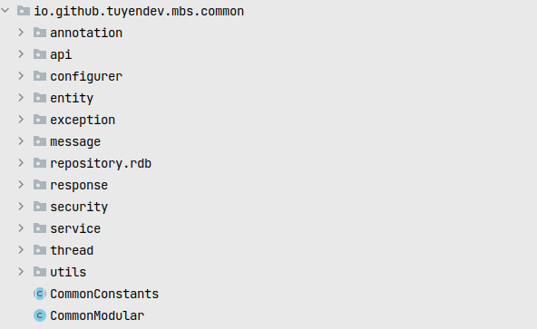
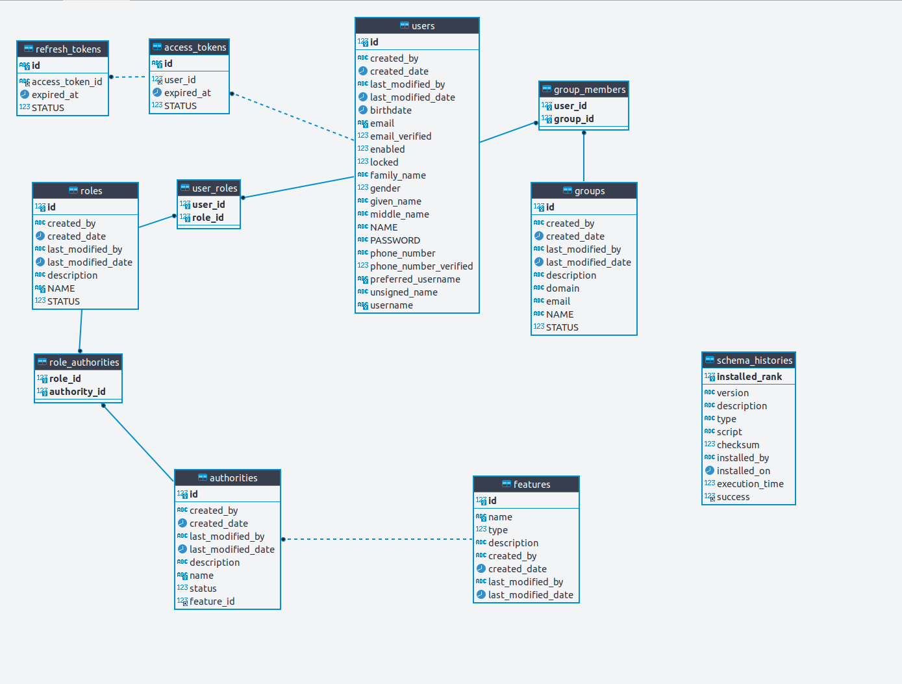
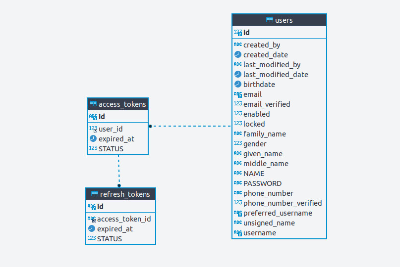
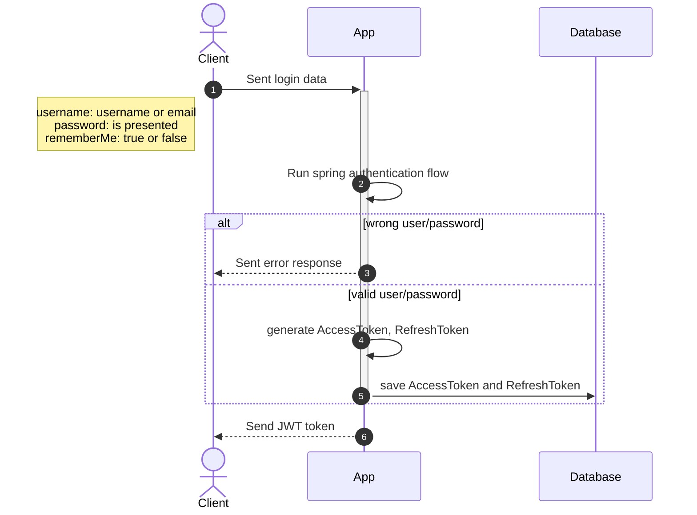
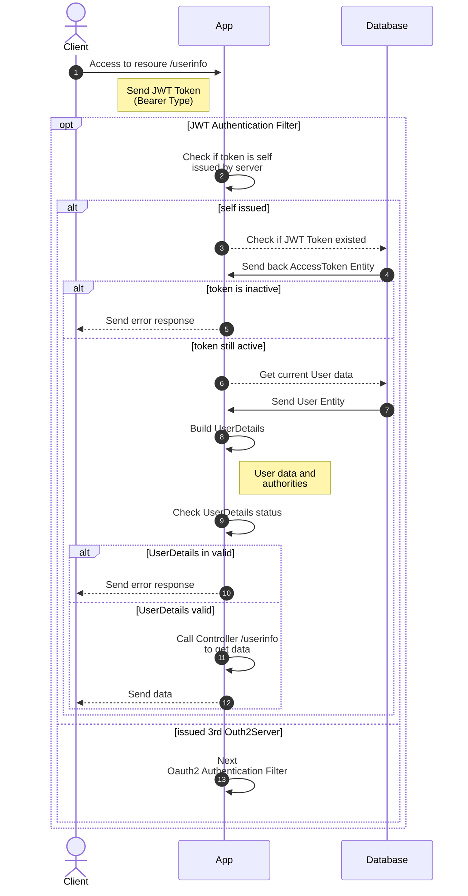
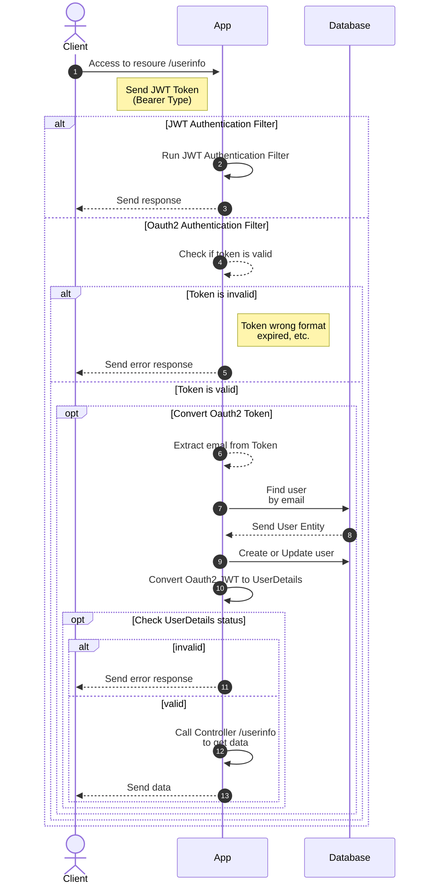
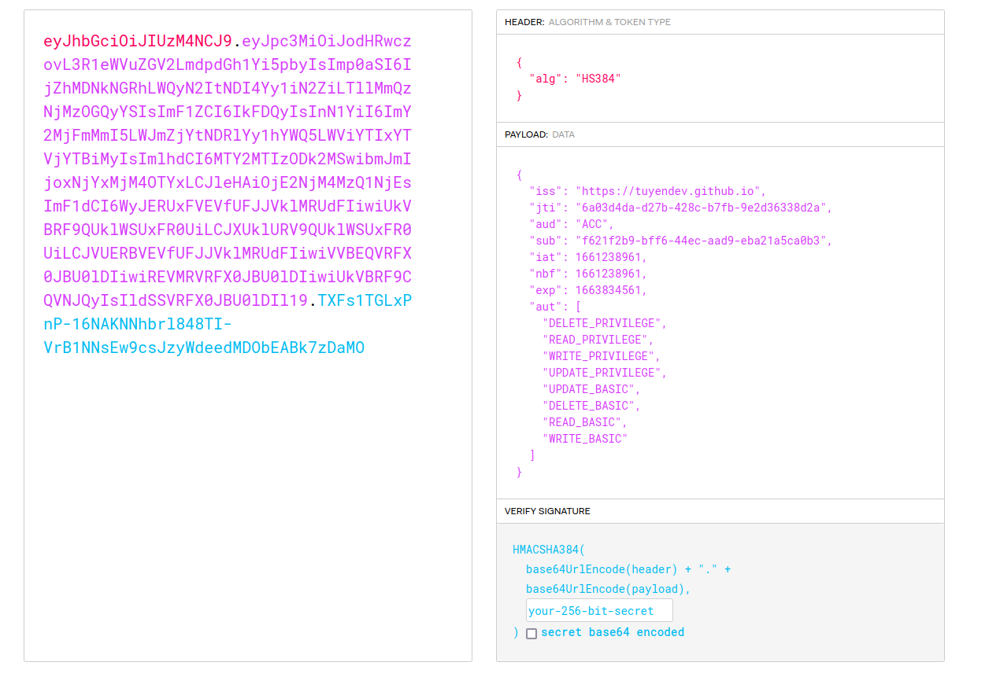

# Let's get started

As a java developer, I spent most of my time to work with Spring Boot - a powered framework. Spring Boot also has many
configurations that make you confuse, through. I started to create a boilerplate framework for monolithic app to handler
some aspects to get business faster.

Some aspects of this project

- [x] Handle Authentication flow with self JWT and Oauth2 resource server.
- [x] Handle Role -> Privilege Strategy
- [x] Refined ReST response with understood JSON structure.
- [ ] Metrics integration

## Structure

#### COMMON MODULE - settings, configurations for project

> **annotation** package

- **api**: Combination annotation of Spring Boot and Springdocs (OpenAPI) for short. For example
    - ***@RestHandler*** equals ***@RestController*** ***@RequestMapping*** of SpringBoot and ***@Documented***
      ***@Tag(name = "")*** of SpringDocs
- **context**: Cause I separated project to smaller modules ( actually we have more than 6 modules in our private
  business). This is place store some interfaces to get private resource definitions like (MessageSource, Caching,
  etc...). For example: You can see ***MessageResourceClaim*** interface, each module must to define their own
  MessageResource, then when app started, message resources will be initial in all modules.

        // Declare 
        @Modular  
        @PropertySource({"classpath:common00.properties"})  
        public class CommonModular implements MessageResourceClaim {  
           @Override  
          public String[] messageSource() {  
              return new String[] {"classpath:common-messages"};  
           }  
        }
  	
        // Initial
        @Configuration  
        @RequiredArgsConstructor  
        class MessageSourceConfigurer {  
      
           private final List<MessageResourceClaim> instructors;  
        
           @Bean  
           @Primary @Order(Ordered.HIGHEST_PRECEDENCE)  
           public MessageSource messageSource() {  
              var sourcePaths = StreamEx.of(instructors)  
                    .map(MessageResourceClaim::messageSource)  
                    .flatMap(Arrays::stream)  
                    .toArray(String.class);  
        
            var messageSource = new ReloadableResourceBundleMessageSource();  
            messageSource.setBasenames(sourcePaths);  
            messageSource.setDefaultEncoding(StandardCharsets.UTF_8.name());  
            return messageSource;  
           }  
        }

> **configurer** package

- ***AuthenticationProviderConfigurer***: Initial *PasswordEncoder* and *UserDetailsService* for self JWT authentication
  flow
- ***BootstrapAppConfigurer***: Initial default ADMIN user and role (ADMIN, MEMBER)
- ***DatabaseAccessConfigurer***: Initial Spring data configuration for (Jdbc and MongoDB) - Can be changed to JPA (but
  I hated JPA)
- ***DefaultWebSecurityConfigurer***: Configure web security for cors, jwt, oauth2 resource server

> **entity** package

- Project is built for MariaDB (**rdb** package) and MongoDB (**mongodb** package)

> **message** package

- **Translator**.eval() help you solve message by multiple languages

> **response** package

- Contain Response template builder for error and success, response always container **status**, **metadata**, **
  payload**

        // Error response sample
        {
            "status": 401,
            "metadata": {
                    "timestamp": "2022-08-23T17:27:21.318259+07:00",
                    "traceId": "a600e902126de187",
                    "reportId": "NTA5NzJlY2YtNWQxMC00MGJmLTk5ZTEtYWJmZjAwMzMyODI5"
            },
            "payload": {
                    "message": "Authentication failed",
                    "details": "Token is invalid"
            }
        }

#### CORE MODULE - implement your business

> Implementation of business logic

## PROJECT MODEL

## [Take a look on Spring Security](https://docs.spring.io/spring-security/reference/servlet/architecture.html)

## Authentication With JWT

**Generate Token**

**Using Token To Access Resource**

### Implementation

## Authentication as  Oauth2 resource server

## Role Strategy
### Explanation

- Each **Module** treated as **Feature** table in database. Feature/Module has each own pre-defined
  privileges/authorities can be
  configurable by implement
  interface [FeaturePrivilegeClaim](https://github.com/tuyendev/monolithic-sample-app/blob/dev/backend/common/src/main/java/io/github/tuyendev/mbs/common/annotation/context/FeaturePrivilegeClaim.java)

  		public interface FeaturePrivilegeClaim {  
  		  
  		  /**  
  		  * Not changeable field, change name will cause problems to running app * @return  
  		  */  
  		  String getName();  
  		  
  		  /**  
          * A changeable field, can be updated to re-initial 
          * @return  
  		  */  
  		  String getDescription();  
  		  
  		  /**  
  		  * A changeable field, can be updated to re-initial
  		  * Privileges presented by a map that contain (name as key, description as value)
  		  * The name of each Privilege should be unique in the whole system.
          * @return
  		  */  
  		  Map<String, String> getPrivileges();  
  		}

Example: Feature **SALE** included *READ_REPORT, CREATE_REPORT, READ_CONTRACT, CREATE_CONTRACT, DELETE_CONTRACT,
APPROVE_CONTRACT*

- Role is groups of Authority. For example, we can have **SALE_VIEWER_ROLE** with authorities *READ_REPORT &
  READ_CONTRACT* or **SALE_MAKER_ROLE** included *READ_REPORT, CREATE_CONTRACT, DELETE_CONTRACT*.
- Each *User* can define mutiple *Role*-s. When a user do login, or access by token, all associate authorities will be
  added automatically.

- In java code, developer can simple using @PreAuthorize or @PostAuthorize to handle access

      @GetRequest  
      @PreAuthorize("hasAuthority('READ_CONTRACT')")  
      public Response<String> doSomething() {  
         return Response.ok();  
      }

### Implement

- Implementation **FeaturePrivilegeClaim** interface

  		@Modular  
  		@PropertySource({"classpath:common00.properties"})  
  		public class CommonModular implements MessageResourceClaim, FeaturePrivilegeClaim {  
  		   @Override  
  		  public String[] messageSource() {  
  		      return new String[] {"classpath:common-messages"};  
  		   }  
  		  
  		   @Override  
  		  public String getName() {  
  		      return "COMMON";  
  		   }  
  		  
  		   @Override  
  		  public String getDescription() {  
  		      return "Access to common resource";  
  		   }  
  		  
  		   @Override  
  		  public Map<String, String> getPrivileges() {  
  		      return Map.of("COMMON_READ", "app.common.message.privilege.read");  
  		   }  
  		}

- Initial setup at application
  boot [Sample code](https://github.com/tuyendev/monolithic-sample-app/blob/dev/backend/common/src/main/java/io/github/tuyendev/mbs/common/configurer/BootstrapAppConfigurer.java#L140)
- See the [mockup](../docs/role-strategy.pdf)
